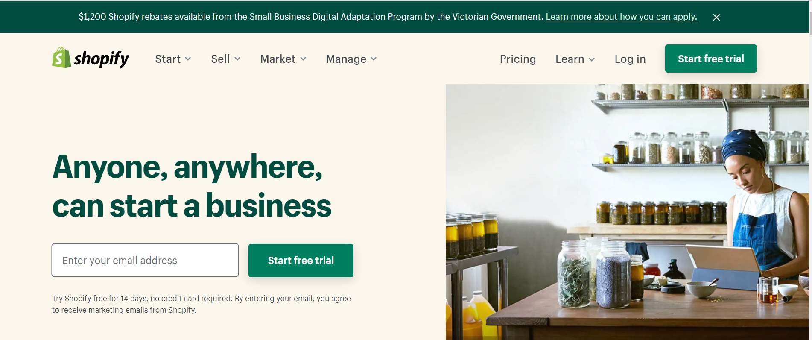

# 
 Shopify-Case-Study
## 
 Danny Milsom
### 
"Start your businesss journey with Shopify
#### 
 Try Shopify for free and explore all the tools and services you need to start, run, and grow your business."  
[Shopify](https://shopify.com)
### When was the company incorporated?
Shopify was founded in 2004. 
### Who are the founders of the company?
Tobias Lutke and Scott Lake founded Shopify. 
### How did the idea for the company (or project) come about?
After Tobias and Scott had a poor experience attempting to open Snowdevil, an online store for snowboarding equipment.  
  
Dissatisfied with the existing e-commerce products on the market, Tobias, a computer programmer by trade, instead built his own. Tobias used the open-source web application framework *Ruby on Rails* to build Snowdevil's online store and launched it after two months of development.  

The Snowdevil founders launched the platform as Shopify in June 2006.  
  
[Wikipedia](https://en.wikipedia.org/wiki/Shopify)
### How is the company funded? How much funding have they received?
The company was largely self-funding until December 2010 when it received $7m from an initial Series A round of venture capital raising.  

It’s Series B round received $15 million in October 2011.  

The company received $100 million in Series C funding in December 2013.  

On April 14, 2015, Shopify filed for an initial public offering (IPO) on the New York Stock Exchange and Toronto Stock Exchange under the symbols "SHOP" and "SH" respectively. Shopify went public on May 21, 2015, and on its debut on the New York Stock Exchange, started trading at $28, more than 60% higher than its US$17 offering price, with its IPO raising more than $131 million.  

[Wikipedia](https://en.wikipedia.org/wiki/Shopify)
### Business Activities
#### What specific financial problem is the company or project trying to solve?
Shopify is an ecommerce platform that empowers its customers to market, sell, transact, ship and manage sales fulfilment.  

Shopify distinguishes itself in providing solutions for almost any business size – from the smallest one- or two-person enterprise through to large scale complex businesses selling millions of dollars of merchandise per week.  

Shopify has made “going online” simple, accessible, and functionally rich. Its customers can seamlessly receive online orders, receive payments (through a variety of direct and indirect channels) and fulfil orders through Amazon, Shopify or any transport\logistics company.  
  
 ### Who is the company's intended customer?  Is there any information about the market size of this set of customers?
Shopify offerings are scaled for almost any size business operation providing solutions to 1,000,000 businesses in 175 countries. Any enterprise that wants to operate an online business can use the Shopify ecommerce platform.  

Ecommerce growth continues to be extremely strong and obviously the Covid-19 pandemic has extenuated this growth. In 2019, retail ecommerce sales worldwide amount to $3.53 trillion US dollars with sales projected to grow to $6.54 trillion by 2022.  

[Statista](https://www.statista.com/statistics/379046/worldwide-retail-e-commerce-sales/)

In Australia e-commerce has enjoyed similar growth and is expected to reach $33.1 billion AUD in 2020.

[Statista](https://www.statista.com/outlook/243/107/ecommerce/australia)

### What solution does this company offer that their competitors do not or cannot offer? (What is the unfair advantage they utilize?)
Shopify’s key advantage has been its commitment to innovation, technology leadership and leveraging strategic partnerships with organisations such Amazon, Facebook, Snapchat and Apple.  

The key differentiators of Shopify are its:  
  1. Ease of use – upwards from the novice online start-up.  
  2. Scalability in size and complexity of the commercial operations.  
  3. Use of innovative partnerships with organisations such as Amazon, Facebook, Alipay and Snapchat.

It has consistently pursued market leadership in the provision of a complete ecommerce eco system for online businesses of all sizes. 
An example of these advantage of this commitment include:  

•	In June 2009, Shopify launched an application programming interface (API) platform and App Store. The API allows developers to create applications for Shopify online and then    sell them on the Shopify App Store.
•	In April 2010, Shopify launched a free mobile app on the Apple App Store. The app lets Shopify store owners view and manage their stores from iOS mobile devices.  
•	In August 2013 announced the launch of an iPad-centric point of sale system. It uses an iPad to accept payments from debit and credit cards.  
•	In September 2015, Amazon.com announced it would be closing its Amazon Webstore service for merchants and had selected Shopify as the preferred migration provider.  
•	On October 3, 2016, Shopify acquired Boltmade. In November 2016, Shopify partnered with Paystack which allowed Nigerian online retailers to accept payments from                 customers around the world. On November 22, 2016, Shopify launched Frenzy, a mobile app that improves flash sales.  
•	In January 2017, Shopify announced integration with Amazon that would allow merchants to sell on Amazon from their Shopify stores.  
•	In April 2017, Shopify introduced a Bluetooth enabled debit and credit card reader for brick-and-mortar retail purchases. The company has since released additional technology for brick-and-mortar retailers, including a point-of-sale system with a Dock and Retail Stand similar to that offered by Square, and a tappable chip card reader.  
•	On May 11, 2017, Shopify acquired Oberlo, which was one of the star applications on its own Shopify App Store. Oberlo connects Shopify merchants with suppliers who ship products directly to consumers and was acquired for $15M.  
•	In January 2019, Shopify announced the launch of Shopify Studios, a full-service television and film content and production house.  
•	In April 2019, Shopify announced an integration with Snapchat to allow Shopify merchants to buy and manage Snapchat Story ads directly on the Shopify platform. The               company had previously secured similar integration partnerships with Facebook and Google.  
•	In May 2019, Shopify acquired Handshake, a business-to-business e-commerce platform for wholesale goods.  
•	In June 2019, Shopify announced that it would launch its own Fulfillment Network. The service promises to handle shipping logistics for merchants and will compete with an established leader, Amazon FBA. Shopify Fulfillment Network will at first be available to qualifying U.S. merchants in select states.  
•	On August 14, 2019, Shopify launched Shopify Chat, a new native chat function that allows merchants to have real-time conversations with customers visiting Shopify stores online.  
•	On February 21, 2020, Shopify announced it would join the Libra Association, the Facebook-led group aiming to create the Libra digital currency, to help build a new payment network.  
•	In November 2020, Shopify announced a partnership with Alipay to support merchants with cross-border payments.

   
 
[Wikipedia](https://en.wikipedia.org/wiki/Shopify)

### Which technologies are they currently using, and how are they implementing them?  
Shopify's Current Tech Stack  

Currently, Shopify has around 100 applications and technologies in its tech stack. The most popular apps include Shop: Delivery & Order Tracker, Shopify - Ecommerce Business, Logo Maker: Design & Create, Scratch Photos, Hatchful - Logo Maker, Shopify Point of Sale (POS), Frenzy - Buy Sneakers and More, and Shopify Ping.  

There are nearly 3.5 million app downloads per month from the Shopify solutions stack, almost 3 million of which are of Shop: Delivery & Order Tracker across iTunes and Google Play. The Shopify - Ecommerce Business app gets about 300,000 downloads a month.  

Top digital tools include Google Analytics, HTML5, JavaScript, Oberlo, Facebook Shops, Instagram Shopping, Viewport Meta, Apple Mobile Web Clips Icon, Exchange, Burst, and Hatchful.  

There are also upwards of 4,000 apps that can integrate directly with the ecommerce platform. Additionally, Shopify has several free built-in tools in its technology infrastructure, including a logo maker, a QR code generator, a business card maker, a gift certificate template, a privacy policy generator, a shipping label template, and a profit margin calculator.  

[Guidance](https://www.guidance.com/blog/shopify-tech-stack#:~:text=Shopify's%20Current%20Tech%20Stack&text=The%20Shopify%20%2D%20Ecommerce%20Business%20app,Exchange%2C%20Burst%2C%20and%20Hatchful.)

## Landscape:
### What domain of the financial industry is the company in?
Shopify is arguably the world leader in the ecommerce domain of the Fintech industry. 

### What have been the major trends and innovations of this domain over the last 5-10 years?  
Over the past decade, the evolution of both tech hardware and the internet has had a direct correlation with ecommerce. Just as the internet has grown into the desired medium for marketing, advertising, and purchasing of products, goods, and services; eCommerce has grown to rival traditional shopping in many ways.  

Preceded by tech giants like Amazon, who joined the space in 1995, and later Google and Paypal who launched their eCommerce initiatives in 1998.  The overall journey of online shopping is far from complete but it has undoubtedly accelerated in the last decade.  

The most impactful changes that have taken place in the eCommerce realm in the last 10 years, however, include:
1.	The rise of online marketplaces
2.	The seamless shift to using mobile devices for online shopping
3.	The tremendous growth of online and digital marketing and advertising.
4.	The practice of using digital modifications or enhancements to reality in sales and consumer shopping.  

[Singularity](https://singalarity.com/blog/our-blog-1/post/the-evolution-of-e-commerce-over-the-last-decade-7)

### What are the other major companies in this domain?
The *WebsiteBuilderExpert* site lists 7 top competitors to Shopify being:
1.	BigCommerce
2.	Volusion
3.	WooCommerce
4.	Wix
5.	Squarespace 
6.	Square Online
7.	Weebly  

“BigCommerce is Shopify’s biggest competitor due to its huge range of powerful sales features, while Volusion offers great analytics for tracking your store’s data. WooCommerce is self-hosted, which brings technical challenges but gives you more control. Wix is best for smaller businesses looking for greater creative freedom, but Squarespace has the most stunning designs. Square Online takes the cake for value, and Weebly is ideal for entrepreneurs.”  

[WebsitebuilderExpert](https://www.websitebuilderexpert.com/ecommerce-website-builders/comparisons/shopify-alternatives-competitors/)  

### Results
#### What has been the business impact of this company so far?  
Shopify leads the industry for providing accessible, simple and affordable e-commerce platforms for enterprises of any size. It understood the market power and profitability that came by empowering any business enterprise of any size or complexity to become an on-line business.  

Its impact has been profound. Not only did it set an example for similar companies to follow (as example note the list competitor companies above) it has been extremely popular. Over 1,000,000 businesses in 175 countries have made over $200 billion USD in sales using Shopify.  

[Shopify](https://shopify.com)

#### What are some of the core metrics that companies in this domain use to measure success? How is your company performing, based on these metrics?  
In assessing key attributes or features of ecommerce platforms most comparisons are made based on:  
1. Price
2. Support
3. Payment processing fees and options
4. Ease of Entry
5. Features
6. Community Size

#### How is your company performing relative to competitors in the same domain?
After surveying several different comparison sites Shopify is consistently ranked number one against these categories. 

However, an exception is *WebsiteBuilderExpert,* which ranked Wix the best ecommerce overall by a very slim margin however ranked Shopify as best for large commercial sites. 

[WebsitebuilderExpert](https://www.websitebuilderexpert.com/ecommerce-website-builders/comparisons/shopify-alternatives-competitors/)  

### Recommendations:
#### If you were to advise the company, what products or services would you suggest they offer? 
My three key recommendations for Shopify is for it to provide:
  1.	Seamless trade finance. That is provide customers with the ability to purchase goods on credit and then provide factor finance once the goods are sold. Thus, reducing the       capital requirements for start-ups. 
  2.	Increase the solution to provide seamless Warehouse Management Services (WMS) and Transport Management Services (TMS). Currently this requires integration to third party         applications such as Cargo Wise and/or SmartFreight. 
  3.	Further to point 2 is for Shopify to provide enhance automation so an order once picked can be seamlessly managed from picking the order through to shipping, delivery           tracking and POD confirmation. 
  4.	Provide a blockchain/smart contract solution providing an alternative to using letters of credit, US dollars and the Swift payment system. A similar - but far more               complex enhancement - to one implemented in August 2013 when it released Shopify payments -which allowed merchants to accept credit cards without requiring a third-party         gateway. 
#### Why do you think that offering this product or service would benefit the company?
The three ideas contained in the previous section would benefit the company by:
  1.	Increasing the ease and simplicity of becoming an on-line business through simplified financing requirements. 
  2.	Provide a seamless and automated stock management solution 
  3.	Facilitate easier international sales and trade by providing cheaper processes.  
#### What technologies would this additional product or service utilize?
  1.	Technologies for an integrated WMS and TMS would be very similar to the technologies already deployed by Shopify. 
  2.	Providing trade finance would require similar technology to Shopify payments solutions however would probably require a partnership with a finance company or bank. 
  3.	A blockchain/smart contract solution to facilitate international trade would require a substantial and strategic investment in a block chain technology such as Cardano  and its Marlowe Playground.  
#### Why are these technologies appropriate for your solution?
The first two ideas are simply an extension and enhancement of the same technology and business services currently provided by Shopify. 
Cardano’s Marlow playground has been specifically designed to provide functionality in the financial services space. It is a third-generation proof-of-stake blockchain platform. Whilst not the only alternative for Shopify it would be a highly logical choice of technology for such an initiative. 

